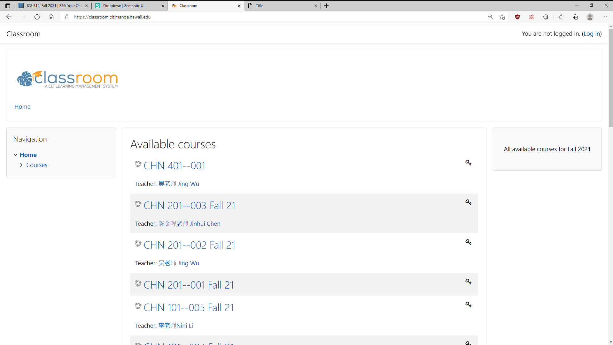
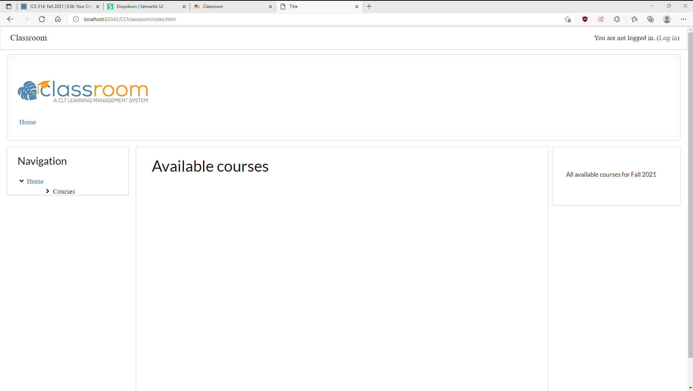

There are good websites and not so good websites throughout the internet. They may look nice and appealing on a webpage but when you look behind the scenes it may not be as simple
as putting things here and there. After learning Semantic UI it showed me how complicated it may be to get things to work as intended. This is because things may overlap or 
formatting may override some other commands that you may want to show instead. It was a challenge to learn so many things at once and implement them well, for me it was challenginglike learning a whole new language. In the end I think it is worth it to try to learn Frameworks because it saves you a lot of time from trying to think up ideas that are already out there. It makes building things a lot easier than if you had to make all the little parts of a website you wanted. 

While going through the excercises to help us learn the frameworks, I did not see some of the instruction videos and tried to work around things with the little knowledge I had 
when making just a menu bar. I mostly used containers on the first time trying to replicate a website and it was of much difficulty because I had to try to put everything together
to work and look as I wanted. But then I found the other videos and it showed me how to use ui class definitions such as centered and columns which made things a lot easier to 
format and not as much thinking because it got formatted with just a few extra words. In the end I was not able to fully finish the page which will be shown below. I think this could be just like trying to do what frameworks do with javascript and css, it would take much more time and a lot more detail into the things instead  of just using the frameworks. 

	
  

