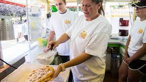

  
	

The carnival is a very hectic place and there are carnivals that go all around Hawaii. Especially at the 50th 
state fair which normally has 2 to 3 times the amount of people coming together. It puts more pressure and a lot more
teamwork needed to put out orders on time. It also makes you think when taking and serving orders because you have
to pick the best time to send or hold someones orders. On the surface there is not much complexity or anything with 
that much pressure, but working there for a year or 2 made me understand the real challenges that come out of the 
carnival.

When I was working at the carnival I was assigned the funnel cake boot. Which is one of the busier booths to
work at because the orders are fast because it takes very little time to deep fry the funnel cake and other items on
the menu. This means that you have to work under a lot of pressure because of the amount of items going out. You 
need to learn to relax because when working the front you have to take orders and send them out at the same time. 
When sending out orders you ask people to wait on the sidewhile taking other orders, but the real problems start 
when sending them out because you have to learn to decide when to send them out. because sometimes you can send out 
smaller orders because a batch of funnels are coming out, but sometimes you have to wait till the full order is 
complete instead. You need great team work because you need to know the timing of funnels coming out and if the 
second window needs a certain order to be sent out. It seems like a never ending line because of the amount of 
people that come to the 50th so you need to keep on working and recuperating. 

I think it is a very good experience when working for high pressure jobs because it taught me a lot about 
working with teammates and having to think a little more on my feet than usual. 
	

