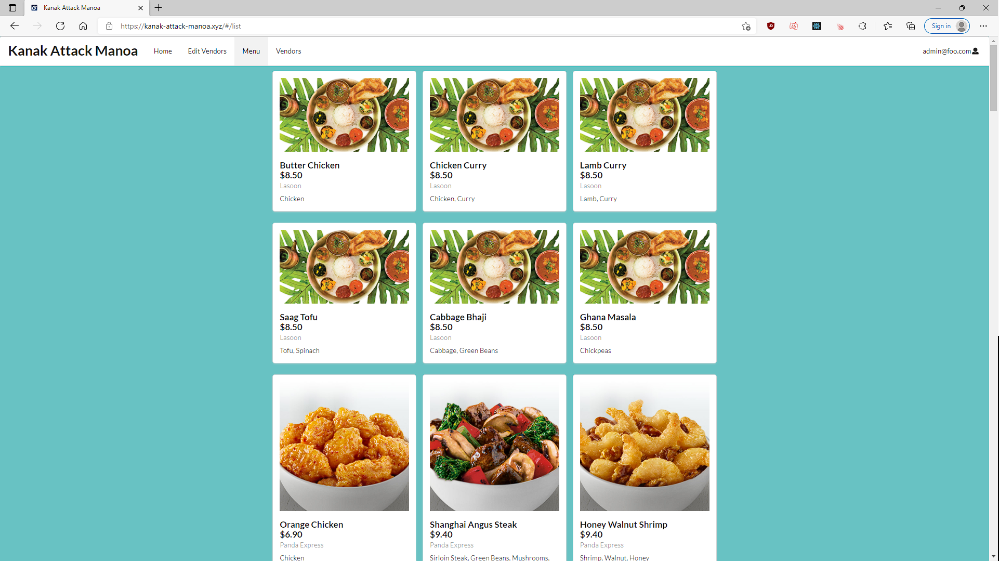

	
  

In this project there was many places to learn and grow from. The team I was on was tasked with making an application for a web browser and it was called Knack Attack Manoa. This application was made to help people find food vendors around the UH Manoa campus and it presents users with pricing, pictures, and ingredients. This was a very interesting project because you had to figure out how to make a page for users, vendors and admins. Trying to give permissions to each level was interesting to see unfold. I was part of getting the admin page running in the beginning and had to set up what was needed for the admin side of the application. Then I had to get the vendor data from the vendors and had to find what data the vendor was gonna present. For the last portion of the project I inputed the data into a private json file because the amount of data that needed to be stored for each menu item and summary of vendor came out to be quite a bit. What I learned from the project is the skills needed to put together a website. 
The second part was having planning and team work for the project. I learned that it is much harder to divide the teamwork up and without people having to change parts that are not part of their own section. This was a little hard to follow because we would all be in our own branches on github and I found it difficult to keep up with all the changes that were happening sometimes. There was also times where I could get help when needed from teammates which was a good thing as well because sometimes a outside perspective would help things move along quicker.This project was a great experience to have because it showed me so much of how to work when making an application with teammates that I had known nothing about. But in the end it was a fun and interesting project.  

